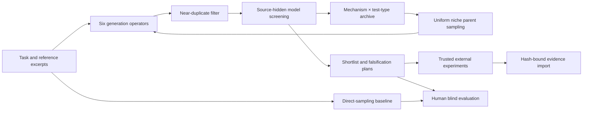

# System architecture

Creativity Lab is a model-agnostic search layer, not a newly trained foundation model. Version 0.2.0 retains the separation between text proposals, model screening, and externally reported measurements, and adds an in-process studio configuration interface.

`engine.py` owns validated records and scheduling. Every generation call requests exactly one idea; every review call screens a shuffled batch with transient aliases. The judge sees no generator identity, search operator, lineage, archive location or lexical proxy. This reduces some source cues; it does not guarantee a fully blind model or independent judgments. Optional judge-model configuration is recorded. No hidden model reasoning is requested or stored.

The six routes are scheduled round-robin. Later lab rounds sample at most two archived parents uniformly across occupied cells and include their critique. Baseline calls use a fixed direct-generation instruction without parents, prior candidates or archive guidance. Both modes receive the same task and reference corpus, and use the same review rubric. Deduplication or exhausted budgets can cause different actual call/candidate counts; results record this instead of asserting perfect matching.

Within a cell, quality is `0.45 * usefulness + 0.35 * feasibility + 0.20 * testability`. These weights are transparent engineering defaults, not scientifically calibrated creativity scores. Admission requires usefulness ≥0.35 and feasibility ≥0.25. Novelty and surprise stay separate rather than rewarding bizarre outputs with a high combined score. The taxonomy (6 mechanisms ×4 test types) is a coarse model-reported descriptor and requires empirical validation; occupancy alone is not semantic diversity.

The lexical proxy uses English word/Chinese bigram Jaccard overlap of descriptions. Titles do not affect it. Near duplicates at similarity ≥0.92 are rejected; final novelty proxies are recomputed against all other accepted descriptions plus the supplied corpus. Semantically equivalent paraphrases can evade this filter. No live literature retrieval, embeddings or global originality certificate is implemented.

`providers.py` makes one HTTP request per reserved call, without hidden retries. Failed requests count. API keys remain in process memory and headers; run logs contain model and endpoint hostname only. Missing usage is marked incomplete. Seeds control local route/parent/alias ordering, not the remote provider's sampling. The adapter requests at most 4096 completion tokens per call, but the total hard limit is calls. Dollar budgets and hard total-token limits are not implemented.

`evaluation.py` generates direct-sampling comparisons, exports review packs and validates votes. A/B order is randomized. Review packs exclude internal scores and private origin labels; the mapping must stay with the coordinator. Repeated seeds on the same task are not independent tasks. Wilson intervals apply to decisive binary choices, not a universal population of creativity.

`validation.py` binds external measurement rows to the exact idea fields via SHA256. Evidence does not change model scores or automatically drive a new search round in this release. The hash prevents accidental attachment to a revised idea; it does not authenticate who measured it. External artifacts and protocols are reported strings, not automatically checked. No generated code is executed.

`web.py` serves a loopback-only asynchronous UI with bounded inputs, same-origin checks and a single active run. Jobs live in memory; export them before stopping the server. Model outputs are rendered as text. No remotely hosted service or model weights are shipped.

The studio's model settings cover the compatible API base URL, generator model, API key, optional judge model and completion-token parameter. Applying settings updates only the current service's in-memory configuration; there is no default disk persistence. GET configuration responses and run exports do not include the key. A restart restores the startup environment configuration, or requires the user to enter settings again. Separate CLI processes continue to use their own environment variables. The judge model uses the same endpoint and key. Testing a connection sends a short JSON model request and may incur provider charges; it does not measure creative quality.

Provider and schema errors carry a sanitized partial run: already validated candidates, previous archive entries, failed-call budget and a generic failure event survive. CLI stores it and exits unsuccessfully; the studio displays it as an incomplete result. A failed batch remains unreviewed. The run cannot enter a blind comparison until an eligible completed run is available.
