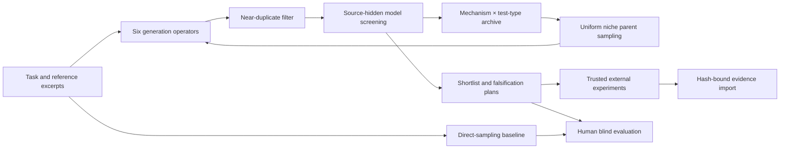

# System architecture

Creativity Lab is a model-agnostic search layer. Version 0.3.0 retains the separation between text proposals, model screening, and externally reported measurements, and extends the in-process studio configuration interface with three API protocols and model discovery.

`engine.py` owns validated records and scheduling. Every generation call requests exactly one idea; every review call screens a shuffled batch with transient aliases. The judge sees no generator identity, search operator, lineage, archive location or lexical proxy. This reduces some source cues; it does not guarantee a fully blind model or independent judgments. Optional judge-model configuration is recorded. No hidden model reasoning is requested or stored.

The six routes are scheduled round-robin. Later lab rounds sample at most two archived parents uniformly across occupied cells and include their critique. Baseline calls use a fixed direct-generation instruction without parents, prior candidates or archive guidance. Both modes receive the same task and reference corpus, and use the same review rubric. Deduplication or exhausted budgets can cause different actual call/candidate counts; results record this instead of asserting perfect matching.

Within a cell, quality is `0.45 * usefulness + 0.35 * feasibility + 0.20 * testability`. These weights are transparent engineering defaults, not scientifically calibrated creativity scores. Admission requires usefulness ≥0.35 and feasibility ≥0.25. Novelty and surprise stay separate rather than rewarding bizarre outputs with a high combined score. The taxonomy (6 mechanisms ×4 test types) is a coarse model-reported descriptor and requires empirical validation; occupancy alone is not semantic diversity.

The lexical proxy uses English word/Chinese bigram Jaccard overlap of descriptions. Titles do not affect it. Near duplicates at similarity ≥0.92 are rejected; final novelty proxies are recomputed against all other accepted descriptions plus the supplied corpus. Semantically equivalent paraphrases can evade this filter. No live literature retrieval, embeddings or global originality certificate is implemented.

`providers.py` makes one HTTP request per reserved generation or review call, without hidden retries. Failed requests count. API keys remain in process memory and headers; run logs contain model, protocol and endpoint hostname only. Missing usage is marked incomplete. Seeds control local route/parent/alias ordering, not the remote provider's sampling. Output limits default to 4096 tokens and can be configured from 256 to 32768; the total hard limit is calls. Provider-specific reasoning tokens may share that output allowance. Dollar budgets and hard total-token limits are not implemented.

The three protocol identifiers are `openai_chat`, `openai_responses` and `anthropic`. Chat uses `messages`, `response_format` when requested, and `max_completion_tokens` by default; an explicit `max_tokens` option supports older compatible gateways. Responses uses `instructions`/`input`, `text.format`, `max_output_tokens` and `store: false`. Anthropic uses `system`/`messages`, `max_tokens`, `anthropic-version` and prompt-based JSON in this release. Both OpenAI protocols also allow prompt-based JSON. Returned text is parsed and validated in every mode; API JSON mode does not establish application-schema correctness. Responses message text blocks and Anthropic text blocks are extracted separately from other output types. Usage fields are normalized, including reported Anthropic cache input counts. Refusal, truncated output, unfinished text, invalid JSON and unsupported response schemas are distinct outcomes.

Authentication defaults to Bearer for OpenAI protocols and `x-api-key` for Anthropic; users can override the header type for compatible gateways. Remote endpoints require HTTPS, and unauthenticated loopback services are allowed. Redirects are refused so credentials cannot be forwarded to an unexpected destination. Upstream response bodies and keys do not enter displayed errors. HTTP status, timeout, TLS, DNS and connection failures have separate error categories; a retryable category is information for manual recovery, not an automatic retry instruction.

`evaluation.py` generates direct-sampling comparisons, exports review packs and validates votes. A/B order is randomized. Review packs exclude internal scores and private origin labels; the mapping must stay with the coordinator. Repeated seeds on the same task are not independent tasks. Wilson intervals apply to decisive binary choices, not a universal population of creativity.

`validation.py` binds external measurement rows to the exact idea fields via SHA256. Evidence does not change model scores or automatically drive a new search round in this release. The hash prevents accidental attachment to a revised idea; it does not authenticate who measured it. External artifacts and protocols are reported strings, not automatically checked. No generated code is executed.

`web.py` serves a loopback-only asynchronous UI with bounded inputs, same-origin checks and a single active run. Jobs live in memory; export them before stopping the server. Model outputs are rendered as text. No remotely hosted service or model weights are shipped. Browser job-status GETs allow at most three attempts per read; a persistent interruption leaves the current page's job id available for explicit recovery. Recovery reads that job again and does not repeat the generation POST. A full page reload or server restart does not provide durable job storage.

The studio's model settings cover base URL, generator model, API key, optional judge model, protocol, JSON mode, authentication type, socket timeout, output limit, optional temperature and Chat output-token parameter. Web settings accept 5–300 seconds, defaulting to 120, for network socket operations; this is not a whole-run wall-clock deadline. Temperature is omitted by default. Applying settings updates only the current service's in-memory configuration, with no disk or browser persistence. GET configuration responses and run exports do not include the key. Stopping the service discards web overrides; a new service uses its environment configuration, or requires the settings again. Separate CLI processes use their own environment variables. The judge shares the generator's endpoint, key and calling settings. Each accepted job captures provider and judge settings before background execution, so a later edit cannot change an in-flight job.

The studio normalizes a pasted trailing `/chat/completions`, `/responses`, `/messages` or `/models` into its base URL. An Anthropic bare origin gains `/v1`; configured nonempty prefixes remain intact. Changing the endpoint never silently carries a saved key to another address. The displayed request-path preview helps check the final generation route.

`POST /api/settings/models` accepts an unsaved settings draft and performs authenticated model-list GETs without requiring a model name. It never generates text or applies the draft. Each page uses at most a 30-second socket timeout (or the shorter configured value); discovery reads at most five pages and returns at most 500 unique models. Anthropic pagination follows `has_more`/`last_id`; compatible replies accept `data` arrays or `models` mappings. The UI offers the returned ids to both model inputs while preserving manual entry. Failure or an empty listing leaves existing settings usable. A listed model does not establish JSON-generation compatibility.

`POST /api/settings/test` uses the unsaved draft for exactly one short JSON-generation request, with a one-call budget and the configured output allowance. It may incur charges. The response includes elapsed time and budget even when the request fails; a successful test still requires Apply to change saved settings. `/api/settings` applies only validated values, and `/api/settings/reset` discards the override and restores environment-derived settings. Settings mutations and probes require the server-specific settings token as well as origin checks.

With `serve --open`, an occupied port is reused only when its configuration identifies the same installation path and package version. The launcher then opens that service, preserving its in-memory settings and jobs. An older version or a different installation stays running while the new service finds another port. This convenience does not make settings durable once the process stops.

The model-settings interaction was informed by the official [DeepSeek Harness Models page at commit 5badb150](https://github.com/deepseek-ai/deepseek-harness/blob/5badb15009ae1756c3afe0ae0cef1faafc290ccc/packages/client/ui-settings-models/README.zh.md). The adapter and UI are independently implemented, with no copied third-party source. Protocol contracts come from the official [OpenAI Chat Completions](https://developers.openai.com/api/reference/resources/chat/subresources/completions/methods/create), [OpenAI Responses](https://developers.openai.com/api/reference/cli/resources/responses/methods/create), [OpenAI model listing](https://developers.openai.com/api/reference/resources/models/methods/list), [Anthropic Messages](https://platform.claude.com/docs/en/api/messages/create) and [Anthropic model listing](https://platform.claude.com/docs/en/api/models/list) documentation. These describe API contracts; they do not verify a particular compatible service or this project's creativity effect.

Provider and schema errors carry a sanitized partial run: already validated candidates, previous archive entries, failed-call budget and a generic failure event survive. CLI stores it and exits unsuccessfully; the studio displays it as an incomplete result. A failed batch remains unreviewed. The run cannot enter a blind comparison until an eligible completed run is available.
